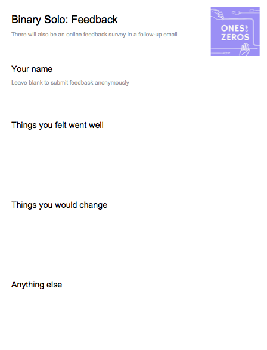

## Ones and Zeros: Binary Solo at Paperhouse writeup

On September 30th 2018, thirteen people plus myself and a lab assistant, Jeremiah, went to Paperhouse Studio for the second public run of our Binary Solo workshop.

We collected feedback with printed forms that were passed around at the end of the workshop. This was our first time conducting surveys on paper, and it was great: we received a response for every participant! We also sent an online feedback survey as we have for past workshop in two follow-up emails. Number of online feedback survey responses: 0.

We will definitely continue to collect paper feedback surveys at the end of workshops, and I plan to continue sending out an online feedback quiz, even if the response rate for it is low. I think people are freer with negative and constructive feedback outside of the workshop, and may have new and different thoughts to share a day or two after the event.

This writeup is a summary of the planning and delivery of the event and the anonymized feedback we received, with some commentary by me (Phil, workshop facilitator). The reflection helps us learn and grow, and sharing it publicly holds us accountable to it.

### Timeline

- August ??: Set a date
- September ??: Announced
- September 30: Workshop!

### Partnerships

This was the first time we worked with other organizations to run a workshop!

[Paperhouse Studio](https://paperhousestudio.com/) provided us with their fantastic space in [Artscape Youngplace](http://artscapeyoungplace.ca/) to host the workshop. We provided Paperhouse with three free workshop seats.

[Chairs and Tables](http://chairsandtables.org/) assisted in planning and marketing, and directly drove 60% of registrations, in exchange for one workshop seat.

### Sponsored Seats

Being accessible

In the month leading up to the workshop, Asad from Chairs and Tables ran into a couple generous people who were keen to sponsor seats. 43% of registrants requested financial assistance.

#### Sponsors Email

### Registration

Apply -> Register

Form questions

Advance payment

### Historical context

loom is ever popular

### Critical discussion

well-received, but need to manage energy. (take a break!)

### Exploration time

More guidance

working image sketches

suggesed ideas &amp; more (&amp; easier) to try example sketches

class zine _totally_ did not work

### Food

After our morning snacks of fresh fruit, homemade oatmeal chocolate chip cookies (all four dozen were eaten!), coffee, tea, juice, and of course, bits and b̶y̶t̶e̶s̶ bites, we served:

- Pasta salad with roasted vegetables and optional feta and olives
- Lentil salad with green onion and parsley
- A DIY sandwich bar featuring baked tofu, smoked chicken, hummus, many vegetable and condiment options, and homemade pink pickled shawarma turnips!

### Community

Our primary focus is serving communities who are not always made to feel welcome in tech spaces. This includes women, people of colour, and members of the Queer community. We can't improve what we don't measure, and currently we do not survey participants, partners, or our team. If you have experience, or connections to people with experience, thoughtfully collecting this kind of information, please get in touch.

We do have some insight into gender diversity via pronouns shared during introductions:

- 69% of participants at the workshop used non-male pronouns
- 68% of total participants from all three Binary Solo workshops used non-male pronouns

### Budget &amp; Accounting

*Be more curious*

